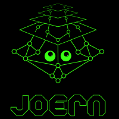
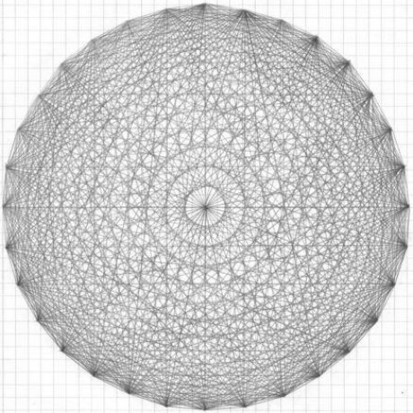
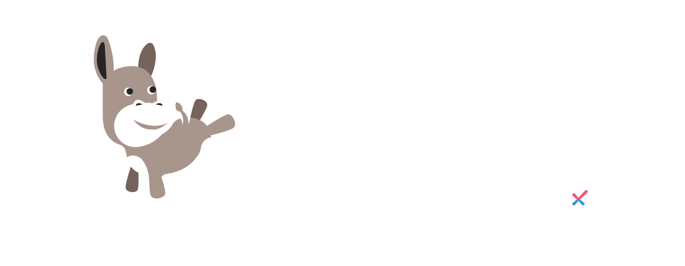
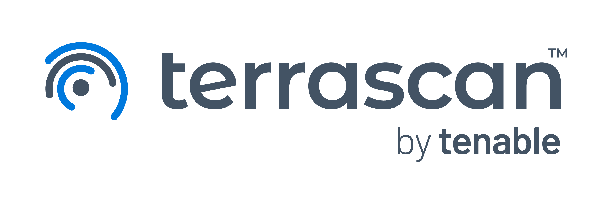
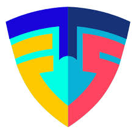
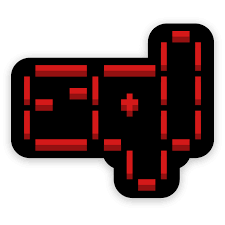
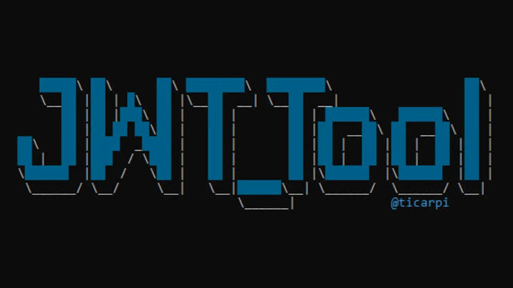
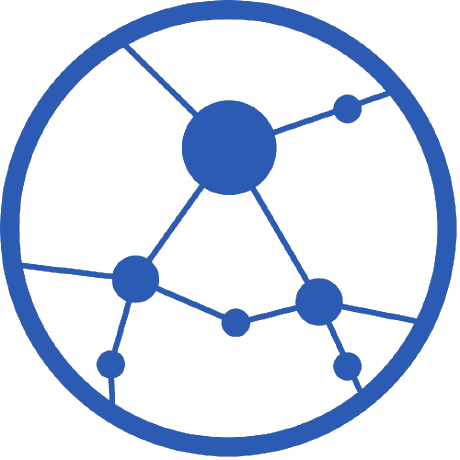
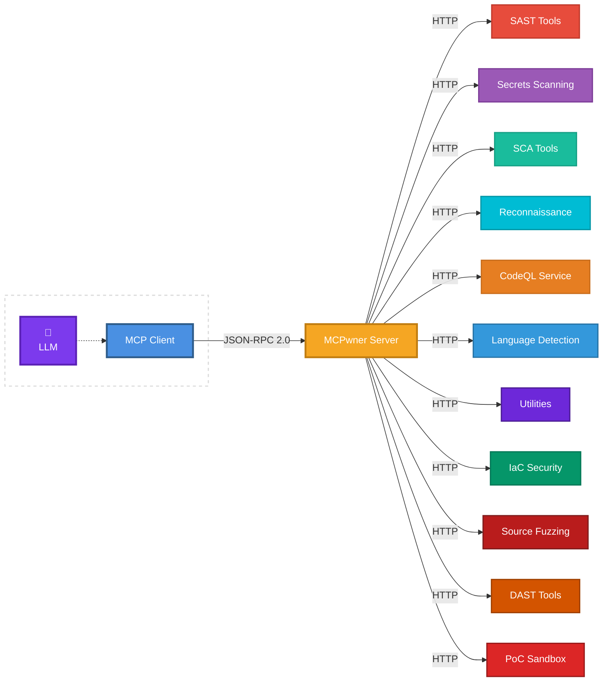

<div align="center">
  <h1>MCPwner</h1>
  
  <h3><i>Beware the Badger</i></h3>
  <p>Model Context Protocol server for autonomous security research</p>

[](https://www.docker.com/)
[](https://modelcontextprotocol.io)
[](https://www.python.org/)
[](LICENSE.txt)

**Compatible with:**

[](#installation)
[](#installation)
[](#installation)
[](#installation)
[](#installation)

</div>

---

## Table of Contents

- [Overview](#overview)
- [Workflow](#workflow)
- [Integrated Tools](#integrated-tools)
- [Installation](#installation)
- [Architecture](#architecture)
- [Data Persistence](#data-persistence)
- [Security Considerations](#security-considerations)
- [License](#license)

## Overview

MCPwner is an MCP server that gives your LLM agent a full offensive-security toolkit. It exposes 55+ containerized tools through a single MCP interface - SAST, SCA, secrets, IaC, reconnaissance, DAST, coverage-guided fuzzing, CodeQL (builtin and custom queries), a headless browser, an OOB callback server, a PoC-script sandbox with deterministic oracles, and a persistent findings ledger.

The architecture is designed for **agent-driven vulnerability research**: a single agent session - model-agnostic (Claude, Cursor, Kiro, Gemini, or any MCP-capable coding agent) - works through the research phases (recon, code audit, PoC validation, adversarial review), recording every step in the shared findings ledger. Each finding progresses from hypothesis through empirical proof to verified report - "no exploit, no report."

> **Note**: This project is under active development. Learn more about MCPs [here](https://modelcontextprotocol.io).

## Workflow

MCPwner is the tool server; your LLM agent is the brain. A typical deep-research engagement:

| Phase         | What happens                                    | MCPwner tools used                                                                               |
| ------------- | ----------------------------------------------- | ------------------------------------------------------------------------------------------------ |
| **Workspace** | Clone target, detect stack                      | `create_workspace`, `detect_languages`                                                           |
| **Discover**  | Broad scan for known patterns                   | `run_sast_scan`, `run_sca_scan`, `run_secrets_scan`, `run_reconnaissance_chain`, `execute_query` |
| **Triage**    | Kill false positives, prove reachability        | `index_code_facts`, `query_code_facts`, `execute_query` (custom CodeQL)                          |
| **Research**  | Hunt novel bugs via diffs and variant analysis  | `diff_discovery`, `run_fuzzing_scan`, custom CodeQL                                              |
| **Prove**     | Empirical validation with deterministic oracles | `run_poc_scan` (sandbox), `run_dast_scan`, `run_utilities_scan` (chromium)                       |
| **Report**    | Only oracle-verified findings ship              | `upsert_finding`, `generate_report`                                                              |

The ledger uses deep-merge upserts, so a later phase's `review` verdict never clobbers the earlier `poc` data (and vice-versa) - and it stays consistent if the agent's context is reset mid-engagement.

## Integrated Tools

<div align="center">

## Reconnaissance

|                    |           |   |                   |   |
| :------------------------------------------------------------: | :-----------------------------------------------: | :--------------------------------------: | :---------------------------------------------------------: | :--------------------------------------: |
| [**Subfinder**](https://github.com/projectdiscovery/subfinder) | [**Amass**](https://github.com/owasp-amass/amass) | [**Nmap**](https://github.com/nmap/nmap) | [**Masscan**](https://github.com/robertdavidgraham/masscan) | [**ffuf**](https://github.com/ffuf/ffuf) |

|                   |                |                 |  |      |
| :------------------------------------------------------: | :----------------------------------------------------: | :------------------------------------------------------: | :----------------------------------------------------------------------------------------------: | :------------------------------------------: |
| [**bbot**](https://github.com/blacklanternsecurity/bbot) | [**httpx**](https://github.com/projectdiscovery/httpx) | [**Katana**](https://github.com/projectdiscovery/katana) |                               [**gau**](https://github.com/lc/gau)                               | [**Arjun**](https://github.com/s0md3v/Arjun) |

|                |              |
| :------------------------------------------------------: | :-------------------------------------------------------: |
| [**wafw00f**](https://github.com/EnableSecurity/wafw00f) | [**Kiterunner**](https://github.com/assetnote/kiterunner) |

## Static Application Security Testing (SAST)

|       |     |        |      |         |
| :--------------------------------------------: | :-----------------------------------------: | :--------------------------------------------: | :-------------------------------------------: | :-----------------------------------------------: |
| [**CodeQL**](https://github.com/github/codeql) | [**Psalm**](https://github.com/vimeo/psalm) | [**Gosec**](https://github.com/securego/gosec) | [**Bandit**](https://github.com/PyCQA/bandit) | [**Semgrep**](https://github.com/semgrep/semgrep) |

<br>

|                |  |                |       |              |           |
| :-------------------------------------------------------: | :------------------------------------: | :---------------------------------------------------------: | :-------------------------------------------: | :-------------------------------------------------: | :--------------------------------------------------: |
| [**Brakeman**](https://github.com/presidentbeef/brakeman) | [**PMD**](https://github.com/pmd/pmd)  | [**NodeJsScan**](https://github.com/ajinabraham/NodeJsScan) | [**Joern**](https://github.com/joernio/joern) | [**YASA**](https://github.com/antgroup/YASA-Engine) | [**OpenGrep**](https://github.com/opengrep/opengrep) |

## Source Fuzzing

|        |                        |                            |          |
| :----------------------------------------------: | :-------------------------------------------------------------: | :-------------------------------------------------------------------: | :---------------------------------------------------: |
| [**Atheris**](https://github.com/google/atheris) | [**Jazzer**](https://github.com/CodeIntelligenceTesting/jazzer) | [**Jazzer.js**](https://github.com/CodeIntelligenceTesting/jazzer.js) | [**PHP-Fuzzer**](https://github.com/nikic/php-fuzzer) |

## Secrets Scanning

|              |                    |             |             |            |
| :-----------------------------------------------------: | :-------------------------------------------------------------: | :----------------------------------------------------------: | :----------------------------------------------------: | :----------------------------------------------------: |
| [**Gitleaks**](https://github.com/zricethezav/gitleaks) | [**TruffleHog**](https://github.com/trufflesecurity/trufflehog) | [**detect-secrets**](https://github.com/Yelp/detect-secrets) | [**Whispers**](https://github.com/Skyscanner/whispers) | [**Hawk-Eye**](https://github.com/rohitcoder/hawk-eye) |

## Software Composition Analysis (SCA)

|       |      |            |             |
| :-------------------------------------------: | :-----------------------------------------: | :------------------------------------------------------: | :----------------------------------------------------: |
| [**Grype**](https://github.com/anchore/grype) | [**Syft**](https://github.com/anchore/syft) | [**OSV-Scanner**](https://github.com/google/osv-scanner) | [**Retire.js**](https://github.com/RetireJS/retire.js) |

## Infrastructure & IaC Security

|              |        |           |           |           |
| :----------------------------------------------------: | :-------------------------------------------: | :---------------------------------------------------: | :------------------------------------------------: | :--------------------------------------------------: |
| [**Checkov**](https://github.com/bridgecrewio/checkov) | [**KICS**](https://github.com/checkmarx/kics) | [**Terrascan**](https://github.com/tenable/terrascan) | [**TFSec**](https://github.com/aquasecurity/tfsec) | [**Hadolint**](https://github.com/hadolint/hadolint) |

## Dynamic Application Security Testing (DAST)

|              |          |              |       |           |
| :---------------------------------------------------: | :-------------------------------------------------: | :---------------------------------------------------: | :--------------------------------------------: | :-------------------------------------------------: |
| [**sqlmap**](https://github.com/sqlmapproject/sqlmap) | [**NoSQLMap**](https://github.com/codingo/NoSQLMap) | [**Commix**](https://github.com/commixproject/commix) | [**Dalfox**](https://github.com/hahwul/dalfox) | [**SSTImap**](https://github.com/vladko312/SSTImap) |

<br>

|             |           |                     |
| :---------------------------------------------------: | :-------------------------------------------------: | :--------------------------------------------------------------: |
| [**SSRFmap**](https://github.com/swisskyrepo/SSRFmap) | [**jwt_tool**](https://github.com/ticarpi/jwt_tool) | [**interactsh**](https://github.com/projectdiscovery/interactsh) |

## Utilities

|                  |           |             |          |                          |
| :---------------------------------------------------------: | :--------------------------------------------------: | :-----------------------------------------------------: | :------------------------------------------------: | :-------------------------------------------------------------------: |
| [**Linguist**](https://github.com/github-linguist/linguist) | [**WireMock**](https://github.com/wiremock/wiremock) | [**Mitmproxy**](https://github.com/mitmproxy/mitmproxy) | [**aiohttp**](https://github.com/aio-libs/aiohttp) | [**Chromium w. Playwright**](https://github.com/microsoft/playwright) |

## PoC Validation

|     PoC-Script Sandbox      |
| :-------------------------: |
| Deterministic oracle runner |

The PoC sandbox runs agent-authored Python/bash exploit scripts inside the target network and returns a **deterministic oracle verdict** (pass/fail based on exit code or explicit markers). This is how MCPwner proves logic bugs, IDOR/BOLA, race conditions, and access-control bypasses that off-the-shelf DAST cannot express.

</div>

## Installation

### Prerequisites

**System Requirements:**

- Docker Engine 20.10+ and Docker Compose 2.0+
- 8GB RAM minimum (16GB recommended for running multiple tools)
- 20GB free disk space (security tool images are large)
- Supported platforms: Linux, macOS, Windows (with WSL2)

**MCP Client:**

- Claude Desktop, Cursor, Kiro, or any MCP-compatible client

### Setup

1. **Clone the repository**:

   ```bash
   git clone https://github.com/nedlir/mcpwner.git
   cd mcpwner
   ```

2. **Configure the server**:

   ```bash
   cp .env.example .env
   cp config/config.yaml.example config/config.yaml
   ```

3. **Start the services**:

   ```bash
   docker compose up -d --build
   ```

4. **Verify services are running**:
   ```bash
   docker compose ps
   ```

### Connect Your IDE

Once Docker containers are running, add MCPwner to your MCP client.

**Dynamic Tool Registration:** MCPwner uses Docker Compose `profiles` for opt-in tool categories. The `.env` file's `COMPOSE_PROFILES` variable controls which containers start. The MCP server probes running containers at startup and registers only healthy tools - if a container is down, its tools simply don't appear. Tools in the `utilities` category run unconditionally.

**One-Click Install (requires Docker running):**

[](https://kiro.dev/launch/mcp/add?name=mcpwner&config=%7B%22command%22%3A%22docker%22%2C%22args%22%3A%5B%22exec%22%2C%22-i%22%2C%22mcpwner-server%22%2C%22python%22%2C%22src%2Fserver.py%22%5D%7D)
[](https://cursor.com/en/install-mcp?name=mcpwner&config=eyJjb21tYW5kIjoiZG9ja2VyIiwiYXJncyI6WyJleGVjIiwiLWkiLCJtY3B3bmVyLXNlcnZlciIsInB5dGhvbiIsInNyYy9zZXJ2ZXIucHkiXX0%3D)
[](https://claude.ai/install-mcp?name=mcpwner&config=%7B%22command%22%3A%22docker%22%2C%22args%22%3A%5B%22exec%22%2C%22-i%22%2C%22mcpwner-server%22%2C%22python%22%2C%22src%2Fserver.py%22%5D%7D)
[](https://vscode.dev/redirect/mcp/install?name=mcpwner&config=%7B%22command%22%3A%22docker%22%2C%22args%22%3A%5B%22exec%22%2C%22-i%22%2C%22mcpwner-server%22%2C%22python%22%2C%22src%2Fserver.py%22%5D%7D)
[](https://windsurf.ai/install-mcp?name=mcpwner&config=%7B%22command%22%3A%22docker%22%2C%22args%22%3A%5B%22exec%22%2C%22-i%22%2C%22mcpwner-server%22%2C%22python%22%2C%22src%2Fserver.py%22%5D%7D)

**Manual Configuration:**

Add to your MCP configuration file (`claude_desktop_config.json`, `mcp.json`, etc.):

```json
{
  "mcpServers": {
    "mcpwner": {
      "command": "docker",
      "args": ["exec", "-i", "mcpwner-server", "python", "src/server.py"],
      "env": {}
    }
  }
}
```

Restart your MCP client to load the new server configuration.

### Scanning Local Projects

Mount your projects into the container by adding a volume in `docker-compose.yaml`:

```yaml
services:
  mcpwner:
    volumes:
      - /path/to/your/projects:/mnt/projects:ro
```

Then use `create_workspace` with `source_type="local"` and `source="/mnt/projects/my-project"`.

## Architecture



**Design Principles:**

- Container isolation for security tool execution
- Standardized output (SARIF/JSON) for LLM consumption
- Dynamic tool registration - only healthy containers appear as tools
- Persistent findings ledger with deep-merge semantics across research phases
- Deterministic oracles for PoC validation (exit code, markers, OOB callbacks, XSS execution)

### Agent Workflow

MCPwner is tool infrastructure. A **single agent session** - model-agnostic (Claude, Cursor, Kiro, Gemini, or any MCP-capable coding agent) - drives the whole engagement, running each phase itself (recon → API mapping → environment → code audit → vulnerability research → PoC → review) and recording progress in the findings ledger. There is no separate orchestration service or configuration file: MCPwner exposes tools, the agent supplies the workflow.

For a long, isolated sub-task - canonically, standing up and driving a live target environment in a container - the agent may optionally offload to a helper session if its host supports one, but the flow never depends on it.

## Data Persistence

MCPwner persists workspace metadata, CodeQL databases, and findings across container restarts using file-based storage in the shared Docker volume (`/workspaces/.metadata/`). The findings ledger is always available (no container health gate) - it's how the agent tracks findings across phases and recovers state after a context reset.

**Workspace Cleanup:**

- `delete_files=True, delete_metadata=False` - Free disk space, preserve history
- `delete_files=True, delete_metadata=True` - Complete removal
- `delete_files=False, delete_metadata=True` - Remove from list, keep files

## Security Considerations

MCPwner executes security tools that perform intrusive operations. Only use on systems you own or have explicit permission to test. The PoC sandbox runs arbitrary agent-authored code inside a resource-capped, unprivileged container - but it is connected to the target network by design.

Restrict MCP server access to authorized users. Review tool configurations before running scans. Follow responsible disclosure practices. Never commit credentials to configuration files - use environment variables.

## License

[Apache 2.0](LICENSE.txt)
