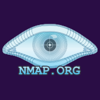
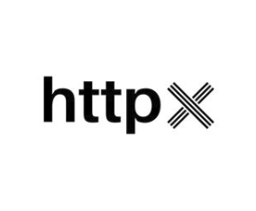
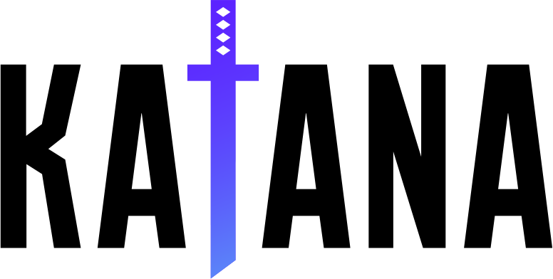
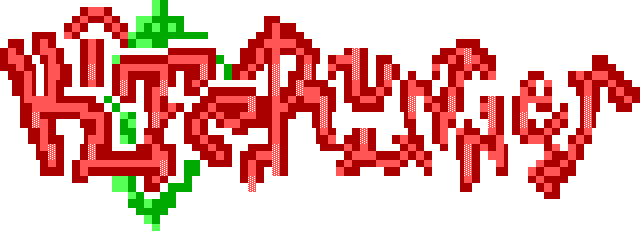
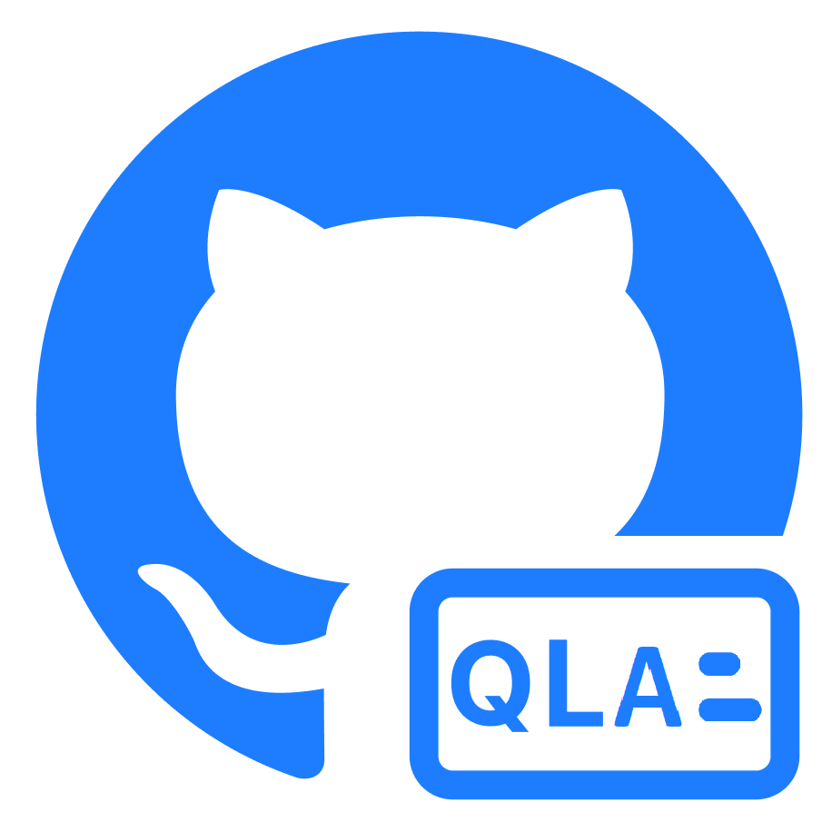
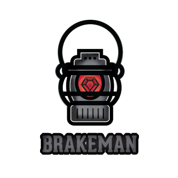
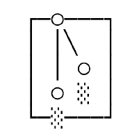
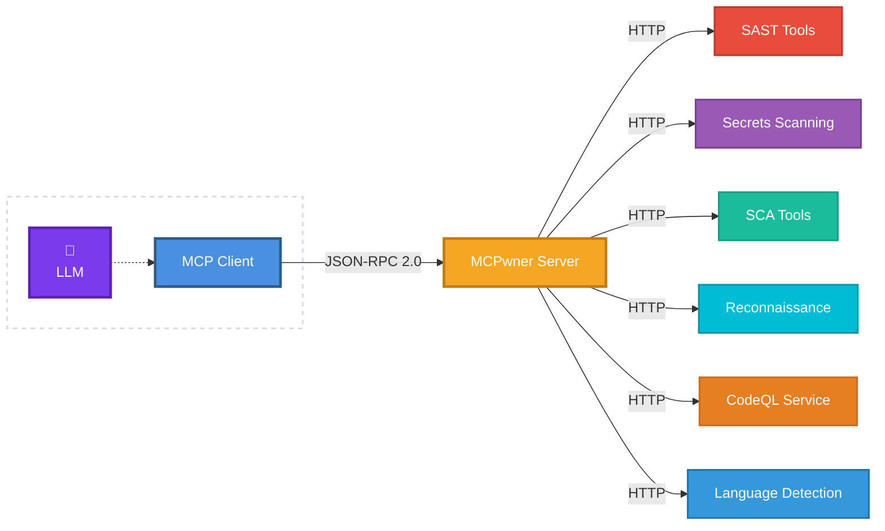
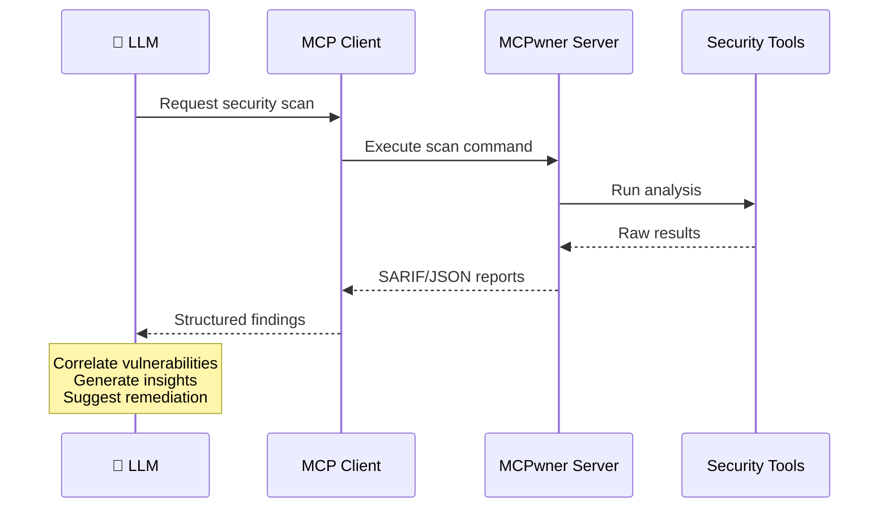

<div align="center">
  <h1>MCPwner</h1>
  
  <h3><i>Beware of the Badger</i></h3>
  <p>Model Context Protocol server for security research automation</p>

[](https://www.docker.com/)
[](https://modelcontextprotocol.io)
[](https://www.python.org/)
[](LICENSE.txt)

**Compatible with:**

[](#installation)
[](#installation)
[](#installation)
[](#installation)
[](#installation)

</div>

---

## Overview

MCPwner is a Model Context Protocol (MCP) server that integrates security testing tools into LLM-driven workflows. It provides a unified interface for secret scanning, static analysis (SAST), software composition analysis (SCA), reconnaissance, dynamic application security testing (DAST), and vulnerability research including 0-day discovery.

Instead of manually chaining tools and pasting outputs into your LLM, MCPwner standardizes and streams results directly into the model's working context. This enables continuous reasoning, correlation, and attack path discovery across the security research lifecycle - from mapping attack surfaces and identifying known vulnerabilities to uncovering novel attack vectors.

> **Note**: This project is under active development. Learn more about MCPs [here](https://modelcontextprotocol.io).

## Key Features

- 🔧 **Unified Interface**: Single MCP server integrating multiple security tools (SAST, SCA, secrets detection, reconnaissance)
- 🤖 **LLM Integration**: Structured output formats (SARIF/JSON) for direct consumption by AI assistants
- 🔍 **Continuous Analysis**: Correlate findings across multiple tools to identify attack paths and 0-day vulnerabilities
- 🏗️ **Multi-Agent Architecture**: Designed for specialized agents collaborating across security phases
- 🐳 **Containerized Execution**: Isolated tool environments for reproducible scans
- 💾 **Automatic Persistence**: Workspace and database metadata survives container restarts
- 🔌 **Extensible**: Plugin architecture for adding new security tools

## Integrated Tools

<div align="center">

## Reconnaissance

|                    |           |   |                   |   |
| :------------------------------------------------------------: | :-----------------------------------------------: | :--------------------------------------: | :---------------------------------------------------------: | :--------------------------------------: |
| [**Subfinder**](https://github.com/projectdiscovery/subfinder) | [**Amass**](https://github.com/owasp-amass/amass) | [**Nmap**](https://github.com/nmap/nmap) | [**Masscan**](https://github.com/robertdavidgraham/masscan) | [**ffuf**](https://github.com/ffuf/ffuf) |

|                 |                |               |            |            |
| :----------------------------------------------------: | :----------------------------------------------------: | :----------------------------------------------------: | :----------------------------------------------: | :------------------------------------------------: |
| [**bbot**](https://github.com/blacklanternsecurity/bbot) | [**httpx**](https://github.com/projectdiscovery/httpx) | [**Katana**](https://github.com/projectdiscovery/katana) | [**gau**](https://github.com/lc/gau) | [**Arjun**](https://github.com/s0md3v/Arjun) |

|                |                    |
| :------------------------------------------------------: | :-------------------------------------------------------------: |
| [**wafw00f**](https://github.com/EnableSecurity/wafw00f) | [**Kiterunner**](https://github.com/assetnote/kiterunner) |

## Static Application Security Testing (SAST) Scanning Tools

|       |     |        |      |         |
| :--------------------------------------------: | :-----------------------------------------: | :--------------------------------------------: | :-------------------------------------------: | :-----------------------------------------------: |
| [**CodeQL**](https://github.com/github/codeql) | [**Psalm**](https://github.com/vimeo/psalm) | [**Gosec**](https://github.com/securego/gosec) | [**Bandit**](https://github.com/PyCQA/bandit) | [**Semgrep**](https://github.com/semgrep/semgrep) |

<br>

|                |  |
| :-------------------------------------------------------: | :------------------------------------: |
| [**Brakeman**](https://github.com/presidentbeef/brakeman) | [**PMD**](https://github.com/pmd/pmd)  |

## Secrets Scanning Tools

|              |                    |             |             |            |
| :-----------------------------------------------------: | :-------------------------------------------------------------: | :----------------------------------------------------------: | :----------------------------------------------------: | :----------------------------------------------------: |
| [**Gitleaks**](https://github.com/zricethezav/gitleaks) | [**TruffleHog**](https://github.com/trufflesecurity/trufflehog) | [**detect-secrets**](https://github.com/Yelp/detect-secrets) | [**Whispers**](https://github.com/Skyscanner/whispers) | [**Hawk-Eye**](https://github.com/rohitcoder/hawk-eye) |

## Software Composition Analysis (SCA) Tools

|  |  |  |  |
| :--------------------------------------: | :-------------------------------------: | :--------------------------------------------: | :-----------------------------------------: |
| [**Grype**](https://github.com/anchore/grype) | [**Syft**](https://github.com/anchore/syft) | [**OSV-Scanner**](https://github.com/google/osv-scanner) | [**Retire.js**](https://github.com/RetireJS/retire.js) |

</div>

## Future Tools

The following tools are planned for future releases:

### Dynamic Application Security Testing (DAST)

- OWASP ZAP, SQLmap, NoSQLMap, Dalfox, Nikto, SSTImap, Commix, jwt_tool, Wapiti, Nuclei,

### OSINT

- Shodan API, Censys API, crt.sh, Altdns, Lazys3, Bucket Stream

### Infrastructure & IaC Security

- Prowler, Checkov, KICS, Terrascan, TFSec, Hadolint

### Exploitation & PoC Development

- Metasploit, Interactsh, Frida

## Usage Examples

### Automated Enumeration Pipeline

```
"Enumerate and scan example.com"
→ MCPwner chains: Subfinder + Amass → Masscan + Nmap → httpx → Katana + gau → ffuf + Arjun
```

### Scan a GitHub Repository for Secrets

```
"Scan https://github.com/example/repo for secrets"
→ MCPwner runs Gitleaks, TruffleHog, detect-secrets and correlates findings
```

### Security Audit

```
"Run a security audit on my Python project"
→ MCPwner runs Bandit (SAST), OSV-Scanner (SCA), and secrets scanning
```

### Attack Path Analysis

```
"Find vulnerabilities in the authentication module"
→ MCPwner runs CodeQL queries, cross-references with secrets and SCA results
```

## Installation

### Prerequisites

**System Requirements:**

- Docker Engine 20.10+ and Docker Compose 2.0+
- 8GB RAM minimum (16GB recommended for running multiple tools)
- 20GB free disk space (security tool images are large)
- Supported platforms: Linux, macOS, Windows (with WSL2)

**MCP Client:**

- Claude Desktop, Cursor, Kiro, or any MCP-compatible client

### Setup

1. **Clone the repository**:

   ```bash
   git clone https://github.com/nedlir/mcpwner.git
   cd mcpwner
   ```

2. **Configure the server**:

   ```bash
   cp config/config.yaml.example config/config.yaml
   # Edit config/config.yaml as needed
   ```

3. **Start the services**:

   ```bash
   docker-compose up -d --build
   ```

4. **Verify services are running**:
   ```bash
   docker-compose ps
   ```

### Connect Your IDE

Once Docker containers are running, add MCPwner to your MCP client:

**Configuration File Locations:**

- Claude Desktop: `~/Library/Application Support/Claude/claude_desktop_config.json` (macOS)
- Cursor/Kiro: `mcp.json` in your project or settings directory

**One-Click Install (requires Docker running):**

[](https://kiro.dev/launch/mcp/add?name=mcpwner&config=%7B%22command%22%3A%22docker%22%2C%22args%22%3A%5B%22exec%22%2C%22-i%22%2C%22mcpwner-server%22%2C%22python%22%2C%22src%2Fserver.py%22%5D%7D)
[](https://cursor.com/en/install-mcp?name=mcpwner&config=eyJjb21tYW5kIjoiZG9ja2VyIiwiYXJncyI6WyJleGVjIiwiLWkiLCJtY3B3bmVyLXNlcnZlciIsInB5dGhvbiIsInNyYy9zZXJ2ZXIucHkiXX0%3D)
[](https://claude.ai/install-mcp?name=mcpwner&config=%7B%22command%22%3A%22docker%22%2C%22args%22%3A%5B%22exec%22%2C%22-i%22%2C%22mcpwner-server%22%2C%22python%22%2C%22src%2Fserver.py%22%5D%7D)
[](https://vscode.dev/redirect/mcp/install?name=mcpwner&config=%7B%22command%22%3A%22docker%22%2C%22args%22%3A%5B%22exec%22%2C%22-i%22%2C%22mcpwner-server%22%2C%22python%22%2C%22src%2Fserver.py%22%5D%7D)
[](https://windsurf.ai/install-mcp?name=mcpwner&config=%7B%22command%22%3A%22docker%22%2C%22args%22%3A%5B%22exec%22%2C%22-i%22%2C%22mcpwner-server%22%2C%22python%22%2C%22src%2Fserver.py%22%5D%7D)

**Manual Configuration:**

Add the following to your MCP configuration file:

```json
{
  "mcpServers": {
    "mcpwner": {
      "command": "docker",
      "args": ["exec", "-i", "mcpwner-server", "python", "src/server.py"],
      "env": {}
    }
  }
}
```

Restart your MCP client to load the new server configuration.

### Scanning Local Projects

To scan projects from your host machine, mount them into the container by adding a volume in `docker-compose.yaml`:

```yaml
services:
  mcpwner:
    volumes:
      - /path/to/your/projects:/mnt/projects:ro
```

Then use the `create_workspace` tool with:

- `source_type="local"`
- `source="/mnt/projects/my-project"`

## Data Persistence

MCPwner automatically persists workspace and CodeQL database metadata across container restarts using file-based storage in the shared Docker volume (`/workspaces/.metadata/`). No configuration required - the system loads existing data on startup and saves after every operation using atomic writes to prevent corruption.

**Workspace Cleanup Control:**

The `cleanup_workspace` tool provides granular control:

- `delete_files=True, delete_metadata=False` - Free disk space but preserve workspace history (recommended)
- `delete_files=True, delete_metadata=True` - Complete removal of workspace and metadata
- `delete_files=False, delete_metadata=True` - Remove from list but keep files on disk

**Backup:**

```bash
# Backup entire workspaces volume
docker run --rm -v mcpwner_workspaces:/data -v $(pwd):/backup \
  alpine tar czf /backup/workspaces-backup.tar.gz /data

# Restore volume
docker run --rm -v mcpwner_workspaces:/data -v $(pwd):/backup \
  alpine tar xzf /backup/workspaces-backup.tar.gz -C /
```

## Architecture

MCPwner uses HTTP-based communication between containers to support future remote deployments. While currently optimized for local usage, the architecture can be adapted for remote server deployments with minimal modifications.

**Design Principles:**

- Container isolation for security tool execution
- Standardized output formats for LLM consumption (SARIF/JSON)
- Extensible plugin architecture for new tools
- Stateless API (memories are managed by user)

**Architecture Overview:**



## Workflows

**Data Flow - Analysis Results:**



## Available MCP Tools

MCPwner exposes the following tools through the MCP interface:

**Workspace Management:**

- `create_workspace` - Initialize scanning workspace from local path, Git URL, or GitHub repo
- `list_workspaces` - List all available workspaces
- `cleanup_workspace` - Remove workspace and associated data

**SAST (Static Analysis):**

- `run_sast_scan` - Run static analysis tools (Semgrep, Bandit, Gosec, Brakeman, PMD, Psalm)
- `get_sast_report` - Retrieve SAST scan results
- `sast_list_tools` - List available SAST tools

**Secrets Detection:**

- `run_secrets_scan` - Run secrets scanning tools (Gitleaks, TruffleHog, Whispers, detect-secrets, Hawk-Eye)
- `get_secrets_report` - Retrieve secrets scan results
- `secrets_list_tools` - List available secrets scanning tools

**SCA (Software Composition Analysis):**

- `run_sca_scan` - Analyze dependencies for vulnerabilities (Grype, Syft, OSV-Scanner, Retire.js)
- `get_sca_report` - Retrieve SCA scan results
- `sca_list_tools` - List available SCA tools

**Reconnaissance:**

- `run_reconnaissance_scan` - Run a single reconnaissance tool (Subfinder, Amass, Nmap, Masscan, httpx, Katana, ffuf, bbot, gau, Arjun, wafw00f, Kiterunner)
- `run_reconnaissance_chain` - Chain multiple reconnaissance tools sequentially
- `get_reconnaissance_report` - Retrieve reconnaissance scan results
- `reconnaissance_list_tools` - List available reconnaissance tools

**CodeQL:**

- `detect_languages` - Detect languages in codebase via Linguist
- `create_codeql_database` - Create CodeQL database for analysis
- `list_databases` - List available CodeQL databases
- `list_query_packs` - List available query packs
- `execute_query` - Run specific CodeQL queries

**Health & Monitoring:**

- `health_check` - Check server and tool availability
- `list_tools` - List all available tools and their status

## Contributing

Contributions are welcome! Please review the [contribution guidelines](CONTRIBUTING.md) before submitting pull requests.

**Priority Areas:**

- Testing infrastructure (e2e and unit tests)
- Container lifecycle management and optimization
- Multi-stage Docker builds for reduced image sizes
- Enhanced error handling and timeout mechanisms
- Additional security tool integrations

**Contribution Guidelines:**

- Submit focused pull requests with manageable scope
- Include tests for new features
- Follow existing code style and patterns
- Update documentation as needed

See the [Future Tools](#future-tools) section for our development roadmap.

## Security Considerations

MCPwner executes security tools that may perform intrusive operations. Only use on systems and codebases you own or have explicit permission to test - unauthorized access is illegal. Restrict MCP server access to authorized users and consider network isolation for production deployments. Review tool configurations before running scans as some tools can generate significant network traffic or system load. Log tool execution and results, keeping in mind that security scans can trigger alerts in monitoring systems. Follow responsible disclosure practices when reporting vulnerabilities discovered using MCPwner. Keep Docker images updated and scan containers for vulnerabilities regularly. Never commit API keys, tokens, or credentials to configuration files - use environment variables or secret management systems instead.
